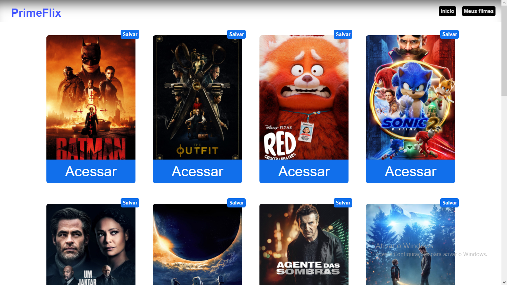
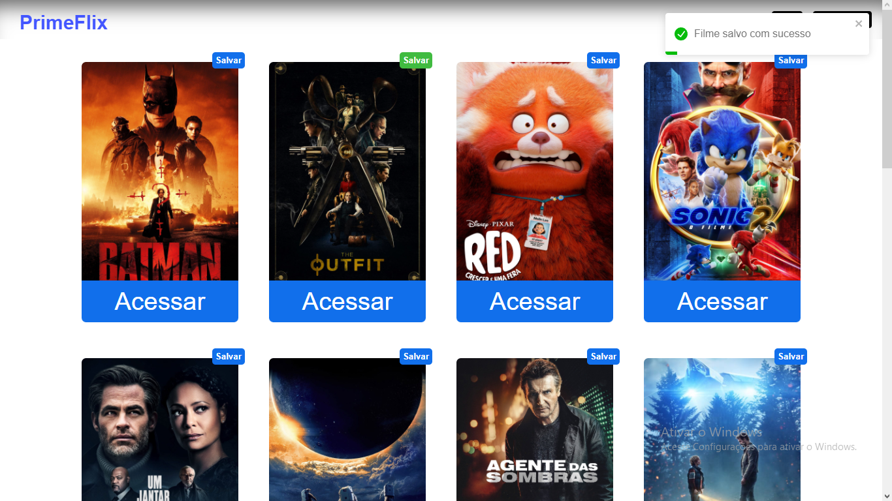
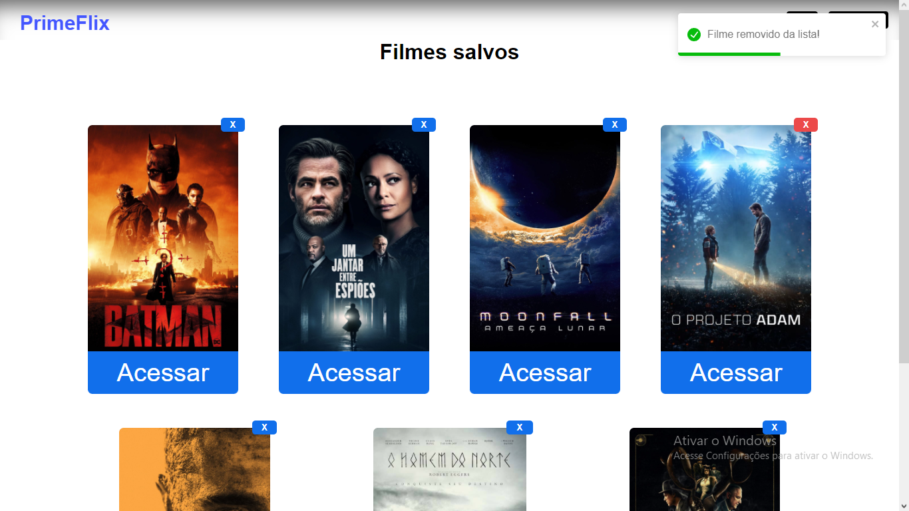

# PrimeFlix

## Sobre o projeto:

Este projeto foi desenvolvido junto ao curso de React da Udemy com o objetivo de criar um site simples utilizando a API da TMDB (The Movie Database) e treinar alguns conceitos de React aprendidos durante o curso.

Foi criada uma interface onde o usuário tem acesso aos filmes lançados mais recentes e atualizados pela API, sendo possível acessar cada filme de forma individual e obter informações sobre ele.
Neste projeto também houveram algumas modificações pessoais, visando uma melhor interface e melhor usabuilidade pelo usuário, mesmo que não fosse o objetivo pro projeto. Por isso, é possível verificar que o site se encontra totalmente responsivo e com maior facilidade para que o usuário consiga salvar os filmes escolhidos.

## Layout do projeto:

Acesse o link e veja o projeto rodando: https://primeflix1.netlify.app

## Tecnologias utilizadas:

* HTML5
* CSS3
* JavaScript
* React JS

## Autor

*Rebeca Bertolini Spósito*

Linkedin:
<https://www.linkedin.com/in/rebeca-bertolini-spósito-544048200/>

E-mail:
<rebeca.bertolinii@gmail.com>